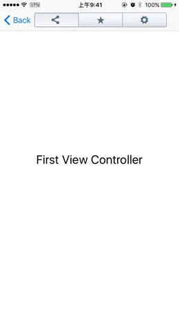
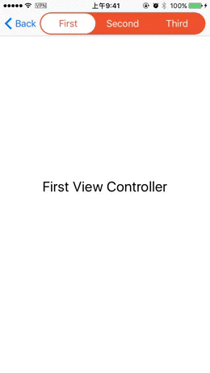
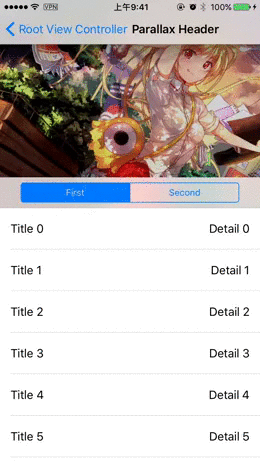
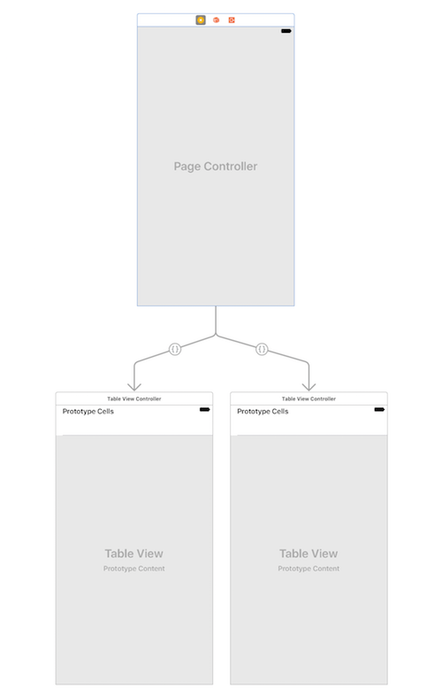

# YTPageController

[](https://travis-ci.org/yeatse/YTPageController)
[](http://cocoapods.org/pods/YTPageController)
[](http://cocoapods.org/pods/YTPageController)
[](http://cocoapods.org/pods/YTPageController)

YTPageController introduces a neat and general solution to perform smooth transitions when scrolling between view controllers, like what Apple did in their Music app:


YTPageController can act as a drop-in replacement of `UIPageViewController` in your next app, and you no longer need listening to the contentOffset changes and changing the tint colors or frames your self.

## Introduction

YTPageController provides a property named `pageCoordinator`, which is similar to [transitionCoordinator](https://developer.apple.com/reference/uikit/uiviewcontrollertransitioncoordinator) in UIViewController, for you to perform your own animations during the page transtion.

For example, to animate a `UISegmentedControl`, you can simply add these lines your `YTPageControllerDelegate`:

```objc
// Called before a transition starts
- (void)pageController:(YTPageController *)pageController willStartTransition:(id<YTPageTransitionContext>)context {
    // Add your own animations using `pageCoordinator`
    [pageController.pageCoordinator animateAlongsidePagingInView:self.segmentedControl animation:^(id<YTPageTransitionContext>  _Nonnull context) {
        // Update your segmented control according to the context object.
        self.segmentedControl.userInteractionEnabled = NO;
        self.segmentedControl.selectedSegmentIndex = [context toIndex];
    } completion:^(id<YTPageTransitionContext>  _Nonnull context) {
        if ([context isCanceled]) {
            // If transition canceled, restore to the previous state
            self.segmentedControl.selectedSegmentIndex = [context fromIndex];
        }
        self.segmentedControl.userInteractionEnabled = YES;
    }];
}
```

YTPageController works perfectly with UIKit or third party UI controls, such as [AKASegmentedControl](https://github.com/alikaragoz/AKASegmentedControl):



[BetterSegmentedControl](https://github.com/gmarm/BetterSegmentedControl):



or any view that can be animated:



Refer to the example project for detailed information.

## Basic usage

You have two ways to quickly setup `YTPageController`:

#### In code

You can use `YTPageController` as a child view controller or just by subclassing it. In either way, you must provide your view controllers by setting the `dataSource` property:

```objc
pageController.dataSource = /* your data source object */
```

...or `viewControllers` property:

```objc
pageController.viewControllers = /* an array of child view controllers */
```

If you set both properties, `dataSource` will take the priority.

#### Using storyboard

You can also set up `YTPageController` in storyboard without any code, like what you did before with `UITabBarController`:



Since Apple hasn't provided a custom relationship segue, you need to follow these steps to simulate it:

1. Drag a custom segue from `YTPageController` to one of your child view controllers and change its class to `YTPageControllerSegue`;
2. Name the identifier of this segue with the format `YTPage_{index}`, such as `YTPage_0`, `YTPage_1`, `YTPage_2`, ...

YTPageController will find and perform all these segues in runtime to add the connected view controllers to its child view controllers.

## Example

To run the example project, clone the repo, and run `pod install` from the Example directory first.

## Requirements

iOS 8.0 or above. May be working from iOS 6.0, but I haven't tested it.

## Installation

YTPageController is available through [CocoaPods](http://cocoapods.org). To install it, simply add the following line to your Podfile:

```ruby
pod "YTPageController"
```

## Author

Yeatse CC, iyeatse@gmail.com

## License

YTPageController is available under the MIT license. See the LICENSE file for more info.


